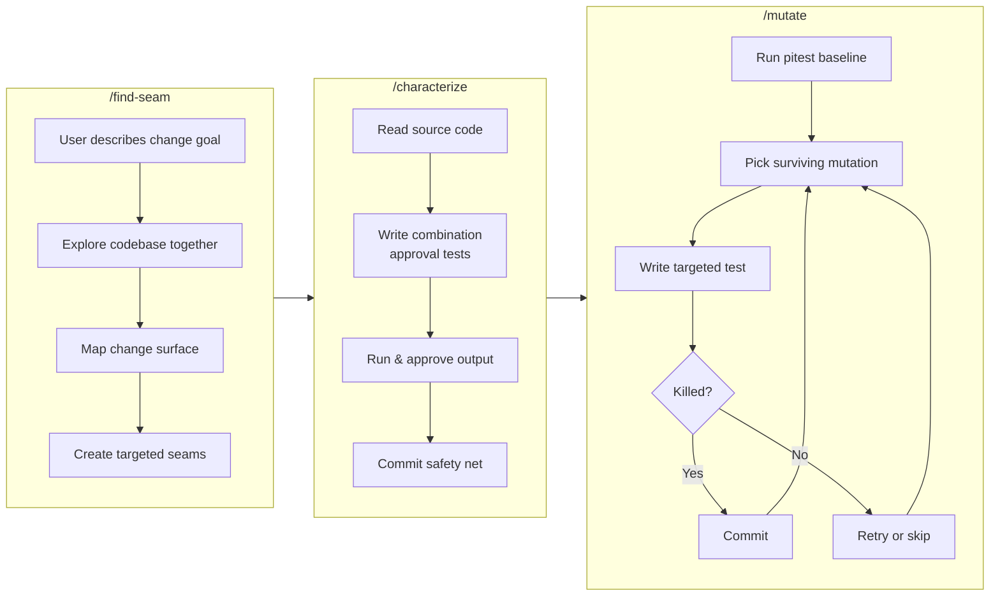
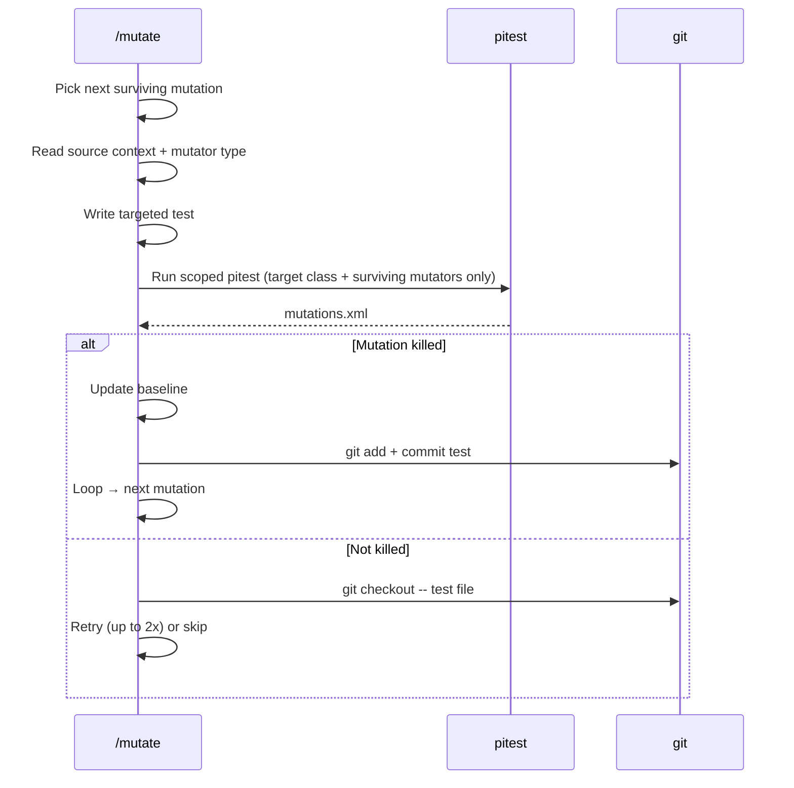

# Legacy Code Rescue

A [Claude Code](https://docs.anthropic.com/en/docs/claude-code) skills toolkit for rescuing legacy Java code. Three skills that follow the workflow from Michael Feathers' *Working Effectively with Legacy Code*.



## Skills

**`/find-seam`** — Collaborative exploration. You describe what you want to change (a behavior, a dependency, a feature), and the skill helps you find where it lives in the codebase, map the change surface, and create the minimum seams needed to get that code under test.

**`/characterize`** — Pin current behavior with combination approval tests using [ApprovalTests.Java](https://github.com/approvals/ApprovalTests.Java). Documents what the code *actually does*, not what it *should do*. One `CombinationApprovals.verifyAllCombinations()` call can cover hundreds of input combinations.

**`/mutate`** — Fully autonomous loop. Runs [pitest](https://pitest.org/) mutation testing, picks surviving mutations one by one, writes targeted tests to kill them, verifies each kill with a scoped pitest run, and auto-commits. Uses the STRONGER mutator group.

## Install

```bash
git clone https://github.com/nymann/legacy-code-rescue.git
cd legacy-code-rescue
./install.sh
```

This symlinks the skills into `~/.claude/skills/`. Restart Claude Code to activate.

## Usage

Open a Java project (Maven or Gradle) in Claude Code:

```
/find-seam       # explore the code, find where behavior lives, create seams
/characterize    # pin current behavior with approval tests
/mutate          # kill surviving mutations autonomously
```

You don't always need all three. `/characterize` → `/mutate` works when code is already testable. `/mutate` alone works when you already have tests and just want to strengthen them.

### What `/mutate` does on each iteration



### Auto-configuration

If pitest isn't configured in your `pom.xml`, `/mutate` adds it automatically with the correct version for your Java source level:

| Java version | pitest-maven version |
|---|---|
| 8 - 10 | 1.17.4 |
| 11+ | 1.18.1 |

JUnit 5 plugin is added automatically if Jupiter is detected. Prefers `./mvnw` wrapper when present.

## Project structure

```
legacy-code-rescue/
├── install.sh                              # Symlink skills into ~/.claude/skills/
├── skills/
│   ├── find-seam/
│   │   ├── SKILL.md                        # /find-seam — explore & create seams
│   │   └── references/
│   │       └── feathers-patterns.md        # Feathers pattern catalog
│   ├── characterize/
│   │   ├── SKILL.md                        # /characterize — approval tests
│   │   └── references/
│   │       └── approvaltests-patterns.md   # ApprovalTests recipes
│   └── mutate/
│       ├── SKILL.md                        # /mutate — mutation testing loop
│       └── references/
│           └── mutator-descriptions.md     # Pitest mutator lookup table
├── scripts/
│   ├── add-pitest-config.py                # Add pitest to pom.xml
│   ├── detect-build-tool.sh                # Detect Maven vs Gradle
│   ├── parse-mutations.py                  # Parse mutations.xml → JSON lines
│   └── run-pitest.sh                       # Run scoped pitest
└── test-fixtures/
    └── gilded-rose/                        # Gilded Rose kata (git submodule)
```

## Test fixture

The [Gilded Rose Refactoring Kata](https://github.com/emilybache/GildedRose-Refactoring-Kata) is included as a submodule for testing:

```bash
cd test-fixtures/gilded-rose/Java
# /characterize → /mutate (no seams needed — just messy conditionals)
```
